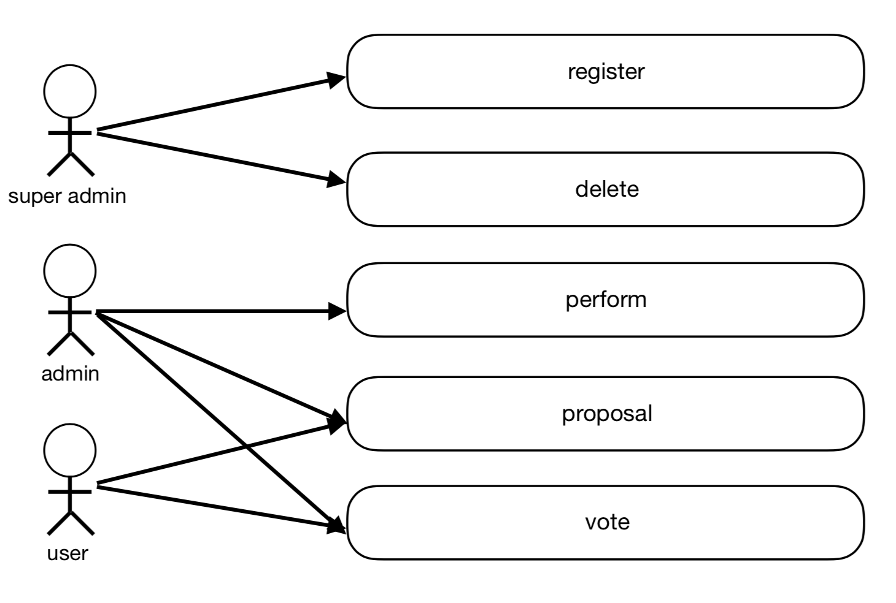
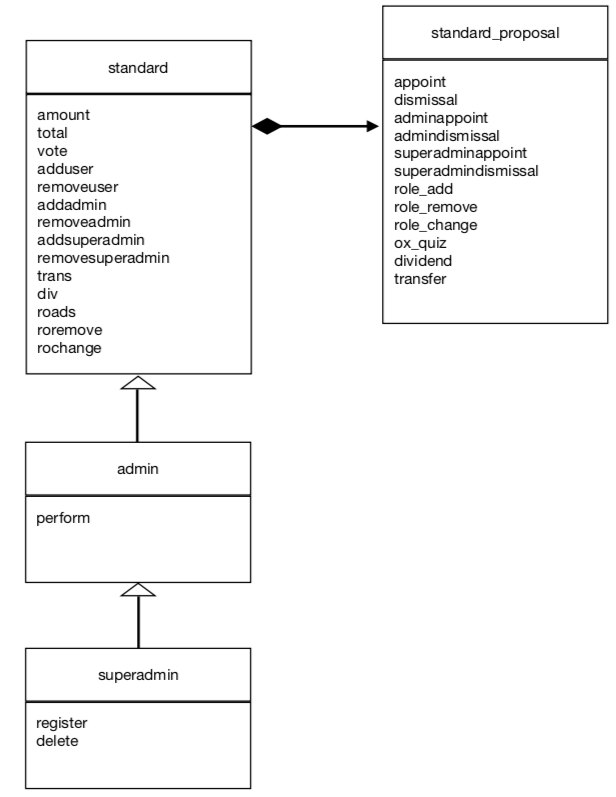
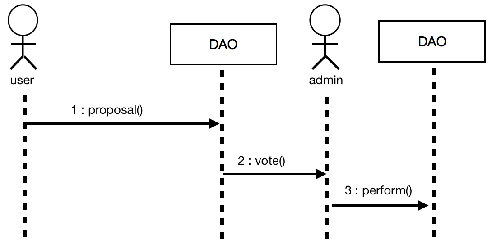
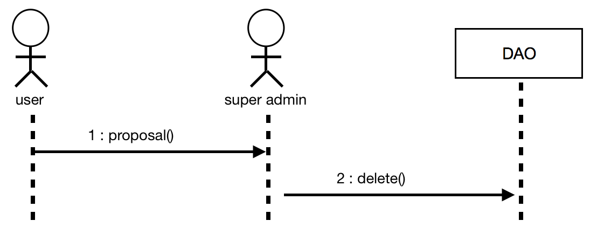

# DAO Sample code
### 개요
Decentralized Autonomous Organization 의 약자로 탈중앙화된자율조직을 뜻한다. 
즉 DAO는 자율적이다. 일단 DAO가 배포되면 외부의 세력이 DAO를 방해 할수 없다.
자율적으로 돌아가는 DAO Sample을 만들어보자.

### 개발 목표
서로 투표를 통해 운영되는 시스템을 만들어보자 
투표권은 소유한 코인양에 비례한다. 
코인이 많을수록 투표에 행사하는 영향력이 증가하는 조직을 개발한다.

### 개발 항목
1. 투표 제안 기능
    * 등록, 사퇴 신청
    * 새로운 규칙 등록 및 규칙 삭제
    * 기존 규칙 변경 
    * O X 투표 신청
    * 코인 배당
        * 투표를 통해 누구한테 코인을 배당할지 결정한다.
    * 코인 송금
        * 코인을 송금시 투표를 통해 송금 여부를 결정한다.
2. 투표 기능
    * 51% 넘을시 제안이 신청된다.
        * 보유한 코인양은 투표 행사력과 비례한다.
3. 투표 등록 제거 (superadmin)
4. 투표 결과 실행 (admin)
5. 코인 보유량 확인

# Usecase
DAO Sample code는 다음의 usecase를 처리할 수 있다.

* `Superadmin`는 최고 관리자로 등록과 삭제 권한을 가지고 있어 엄청난 권력자이다.
하지만 vote를 통해 해고 되거나 임명될 수 있다.
* `Admin`는 vote 결과를 실제적으로 perform 할 수있다. vote 결과를 따라야하며 vote를 통해 해고 될 수 있다.
* `user`는 대부분에 사용자이다 토큰 수에 따라 투표권을 행사할 수 있다.

# Class diagram

## standard
* 기본적인 기능
* method
    * `amount` : 코인 보유량을 조회
        * 코인 보유량이 많을수록 투표에 영향력이 커진다
    * `total` : 공급된 전체 코인양을 확인한
    * `vote` : 찬성,반대 투표를 한다
        * proposal 된 안건을 투표할 수 있다.
    * `adduser` : 새로운 user를 추가한다.
    * `removeuser` : user를 제거한다.
    * `addadmin` : 새로운 admin를 추가한다.
    * `removeadmin` : admin를 제거한다.
    * `addsuperadmin` : 새로운 superadmin를 추가한다.
    * `removesuperadmin` : superadmin를 제거한다.
    * `trans` : 코인을 송금한다
    * `div` : 코인을 배포한다
    * `roadd` : 규칙을 추가한다.
    * `roremove` : 규칙을 제거한다.
    * `rochange` : 기존의 규칙을 변경한다.
    
    
        
## standard_proposal
* standard 을 상속해서 proposal 기능을 확장한다.
* 이 클래스에서는 vote를 제안 할 수 있는 기능이있다.
* method
    * `appoint` : user를 추가할지 vote 한다
    * `dismissal` : user를 제거할지 vote 한다
    * `adminappoint` : admin를 추가할지 vote 한다
    * `admindismissal` : admin를 제거할지 vote 한다
    * `superadminappoint` : superadmin를 추가할지 vote 한다
    * `superadmindismissal` : superadmin를 제거할지 vote 한다
    * `role_add` : 새로운 규칙을 제안하여 vote 한다
    * `role_remove` : 규칙을 제거할지를 vote 한다
    * `role_change` : 기존의 규칙을 변경할지를 vote 한다
    * `ox_quiz` : 찬반 여부를 vote 한다
    * `dividend` : 코인을 누구한테 얼마만큼 배당할지를 vote 한다.
        * 배당 할 코인이 충분히 있는지 확인하고 이벤트를 실행한다.
    * `transfer` : 코인을 송금 시킬지 vote 한다.
        * 송금 할 코인이 충분히 있는지 확인하고 이벤트를 실행한다.
    
## admin
* admin 기능
* method
    * `perform` : admin만 실행 가능하다. vote 에 따른 결과를 실제 실행한다.
        * 찬성율 51% 이상인 안건을 실제로 실행한다.

## superadmin
* 여기에 정의된 모든 기능은 superadmin만 실행할 수 있다.
* method
    * `register` : 등록
    * `delete` : 삭제
        * proposal 에서 신청한 vote를 삭제한다.
             
# Sequence diagram

## proposal

## delete 

