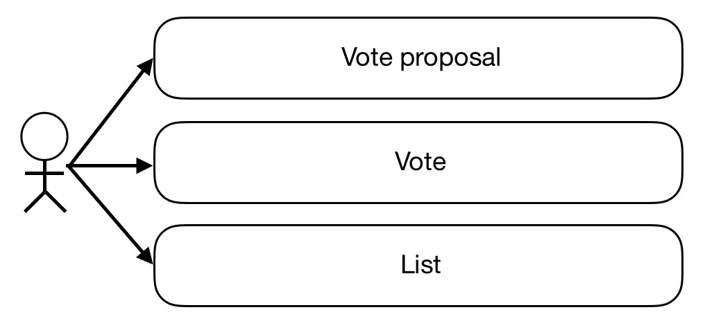
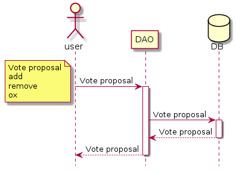
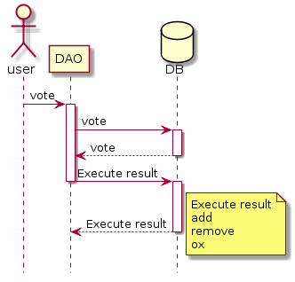
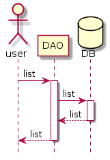

# DAO Sample code
## 개요
Decentralized Autonomous Organization 의 약자로 탈중앙화된 자율조직을 뜻한다. 
즉 DAO는 자율적이다. 일단 DAO가 배포되면 외부의 세력이 DAO를 방해할 수 없다.
자율적으로 돌아가는 DAO Sample을 만들어보자.

## 개발 목표
사내 의사결정 투표 시스템을 구현하자 

       
## Usecase
   
   1. 투표 제안 기능
        * 유저추가
        * 유저제거
        * 찬반 투표 안건 제안
   2. 투표(찬성,반대 표 보내기)
   3. 투표 리스트 확인 기능 
  

## Vote proposal 
   
   
   * 사용자가 어떤 안건을 투표할지 제안한다.
   * 사용자가 투표를 제안하면 제안가능 여부를 확인한 후 제안을 DB에 등록한다.
   * 가능 여부를 확인 후 투표 등록시 투표 등록 유저 현재 날짜 현재 인원수 공통적으로 등록된다.
        * 현재 날짜는 등록된 사용자가 투표 권한이 있는지 확인을 위해 사용한다.
        * 현재 멤버수는 투표에 과반수가 넘었는지 확인을 위해 사용한다.
   * 투표가 제안된 시점보다 이전에 등록된 사용자만이 투표 권한이 있다.
   * method
        * `add` : 추가할 멤버를 투표 신청한다.
            * 추가할 address 입력하여야 한다.
            * 입력한 address 가 기존에 회원 목록에 존재할 경우 진행되지 않는다.
        * `remove` : 제거할 멤버를 투표 신청한다.
            * 제거할 address 입력하여야 한다.
            * 입력한 address 가 기존에 회원 목록에 존재하지 않을 경우 진행되지 않는다.
        * `ox` : 찬반을 가릴 안건을 투표 신청한다.
            * ex) 회식 진행할까요
            * 제안안건 미입력시 진행되지 않는다.

   
      

## Vote
   
   
   * 제안된 투표를 찬성,반대로 투표한다.
   * 유저추가, 유저제거, 제안된안건에 투표할 수 있다.
   * 해당 투표 등록시에 입력된 현재 인원수를 확인하여 과반수가 넘을시 해당 투표결과가 바로 실행됩니다.
   * 해당 투표 등록시에 입력된 날짜를 확인하여 사용자가 투표 권한이 있는지 확인합니다.
   * 모든 투표 결과는 DB에 등록된다.
        * 투표내용,투표 마감 날짜, 결과가 등록된다
   * method
        * `vote` : 해당 투표에 찬성과반대로 투표할 수 있다.
            * 고유코드,찬성및반대 입력
            * 입력한 투표내용은 DB에 등록된다.
            * 해당 제안에 이미 투표한경우 투표할 수 없다.
        * `add_execute` : 멤버 추가 투표가 승인되면 멤버 DB에 등록한다.
            * 입력한 address 현재 날짜가 DB에 등록된다.
            * 현재 날짜는 투표에 권한이 있는지 확인시 사용된다.
        * `remove_execute` : 멤버 제거 투표가 승인되면 멤버 DB에서 제거한다.
            * 제거된 회원도 투표를 통해 다시 등록될 수 있다.
            * 재등록시 기존에 투표 권한은 사라진다.
        * `ox_execute` : 찬반을 가릴 안건 투표 결과를 디비에 등록한다.
            * 투표 안건과 현재 날짜 찬반 여부가 디비에 등록된다.
   
   
       
## List
   
   
   * 투표 목록을 확인한다.
   * 투표등록 날짜, 투표 내용 확인가능
   * method
        * `list` : 투표 목록을 확인한다.
   
   

#
#
#
1. DB 수정 및 삭제 가능 여부
    * DB 수정 불가시 기존에 등록한 찬반 수정
    * DB에 투표나 유저 삭제 가능한지
2. 리스트 확인 가능 여부
    * 조건 여부
    * 투표 여부
        * 중복 여부 확인

       
    
    
    
       

