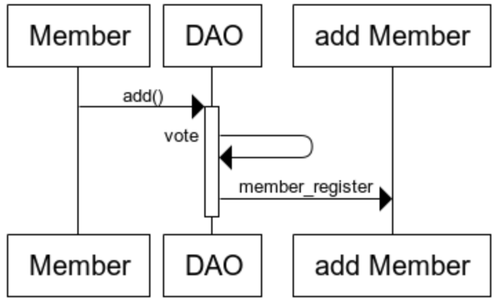
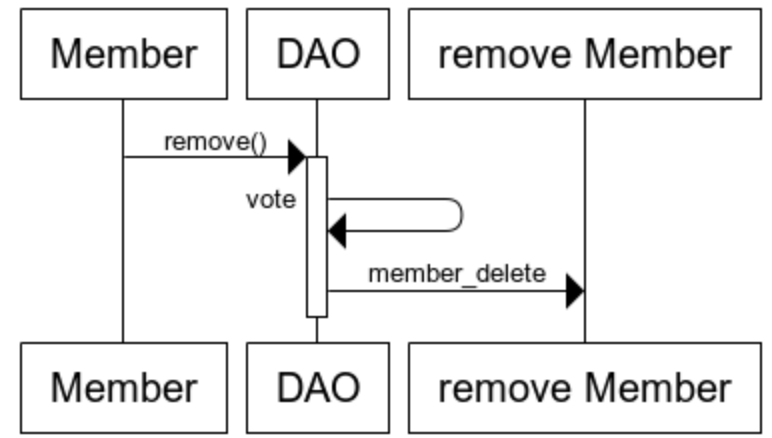

# DAO Sample code
## 개요
Decentralized Autonomous Organization 의 약자로 탈중앙화된 자율조직을 뜻한다. 
즉 DAO는 자율적이다. 일단 DAO가 배포되면 외부의 세력이 DAO를 방해할 수 없다.
자율적으로 돌아가는 DAO Sample을 만들어보자.

## 개발 목표
사내 의사결정 투표 시스템을 구현하자 

       
# Member add&remove 
DAO Samples에 멤버 추가 및 제거 기능 
기존에 멤버가 새로운 멤버를 추가 또는 기존 멤버를 제거를 신청할 수 있다.
과반수 찬성시에 투표는 승인되며 멤버를 추가하거나 제거한다.
    
  

## Member add  
   
   * 기존의 멤버가 add() 실행시 add할 멤버의 address를 입력하여야 한다
   * address 가 기존에 멤버리스트에 존재하는지 확인한다. 
   멤버 리스트에 없는걸 확인 후 투표가 진행된다.
   * 투표 시작시 추가할 멤버(address)와 현재 날짜, 현재멤버수가 등록된다.
   * 찬성 및 반대 표가 입력 될 때 마다 투표 과반수가 넘었는지 확인한다.
        * 과반수 확인은 투표 시작시 등록된 현재멤버수를 기준으로 확인한.
   * 과반수가 찬성하여 투표가 승인시 새로운 멤버(address)와 투표 승인된 시간이 등록된다.
   * method
        * add : 추가할 멤버를 신청한다 (address를 이용하여 신청)
            * 추가할 멤버가 기존 멤버에 존재하는지 확인한다.
            존재 하지 않을 경우에만 투표가 진행된다.
        * member_register : 투표가 승인될시 멤버를 추가한다.
   
   
       * address 현재 날짜
       * 리스트에 현재 있는지 체크
       * 전체 인원 체크
       * 투표 올라감
       * 투표를 할때마다 인원 비율 체크
       * 체크시 과반수가 넘을경우 바로 투표 종료 및 address,현재 날짜

## Member remove  
   
   * 기존의 멤버가 remove() 실행시 remove 멤버의 address를 입력하여야 한다
   * address 가 기존에 멤버리스트에 존재하는지 확인한다. 
   멤버 리스트에 있을 경우에만 투표가 진행된다.
   * 투표 시작시 제거할 멤버(address)와 현재 날짜, 현재멤버수가 등록된다.
   * 찬성 및 반대 표가 입력 될 때 마다 투표 과반수가 넘었는지 확인한다.
        * 과반수 확인은 투표 시작시 등록된 현재멤버수를 기준으로 확인한.
   * 과반수가 찬성하여 투표가 승인시 멤버가 제거된다.
   * method
        * remove : 제거할 멤버를 신청한다 (address를 이용하여 신청)
            * 제거할 멤버가 기존 멤버에 존재하는지 확인한다.
            존재하는 경우에만 투표가 진행된다.
        * member_delete : 투표가 승인될시 멤버를 제거된다.
       
## 공통
   * 투표 신청시 등록된 현재날짜로 멤버에게 투표 권한이 있는지 확인한다.
        * 멤버 등록된 날짜가 투표 신청에 등록된 날짜보다 앞서 있어야 투표 가능하다.

       
     
    
    
       

