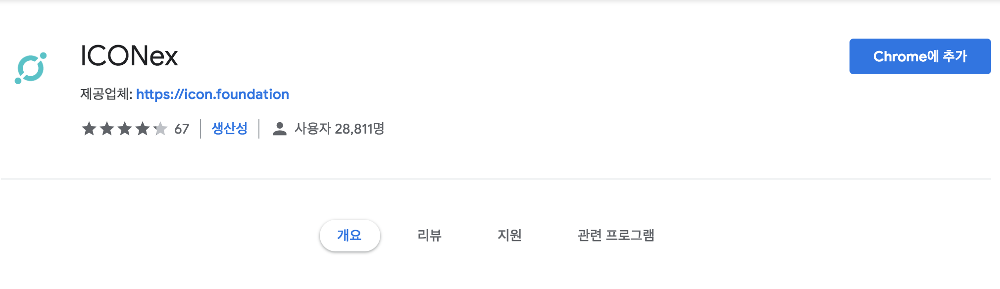
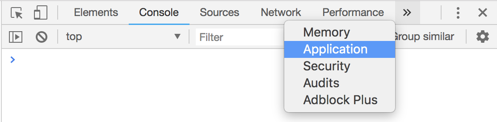
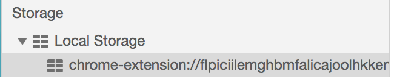
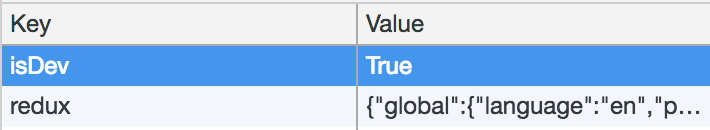
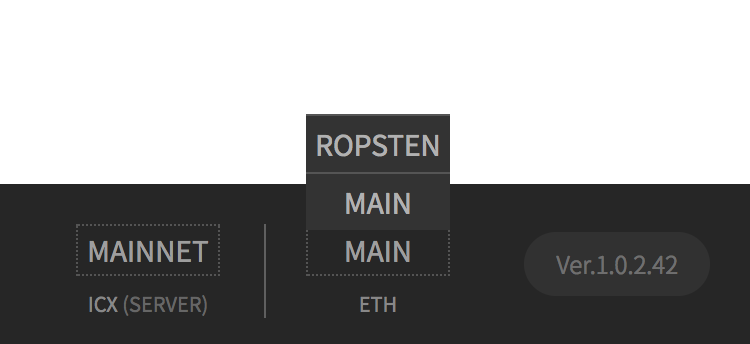

# ICONex for DApp developer

## Installing ICONex(Chrome Extension)
[Download URL - Chrome Web Store](https://chrome.google.com/webstore/detail/iconex/flpiciilemghbmfalicajoolhkkenfel)

---

## Open Chrome DevTools
Press ⌥⌘ I to Open Developer Tools
> Command + Option + I (⌥⌘ I)

## DevTools > Application panel

## Local Storage > chrome-extension...

## Add `isDev` to `Key` / `True` to `Value`

---

## Opting Nertwork

