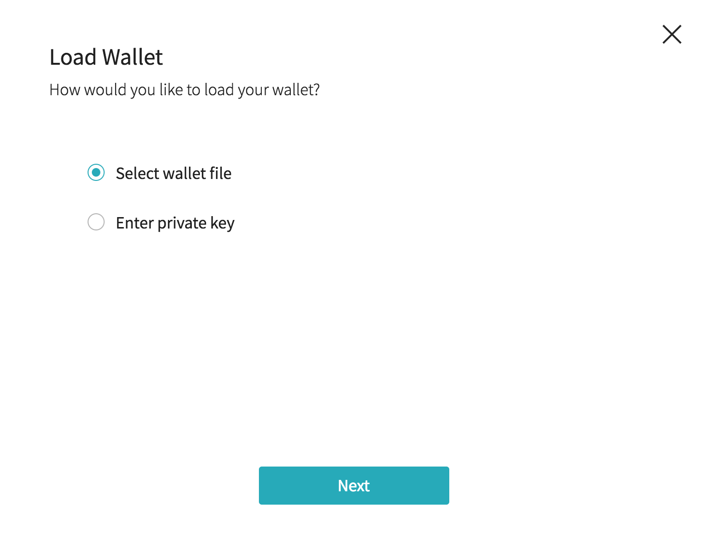

wallet
==============

## wallet
지갑은 ICON에 중요한 역할을합니다. 지갑에는 잔액 및 지갑정보가 들어있습니다. 지갑 상태는 블록에 저장되면 지갑은 ICON 이용에 필수적인 기능입니다.
지갑은 암호화를 사용하여 안전한 보안을 보장합니다.

## Keyfiles
Keyfiles은 private key(개인키), public key(공개키)로 정의되어있습니다 Keyfiles은 JSON형식으로 만들어져 있어 텍스트 편집기를 이용하여
확인할 수 있습니다 Keyfiles 암호화 되어 파일 생성시 등록한 암호로 이용할 수 있습니다.<br>정기적으로 keyfiles을 백업하는 행동이 크게 도움이 될 것입니다.<br>
<br>Keyfiles을 만드는것은 지갑을 만드는 것과 같습니다.

## T-bears 사용하기


#### keystore 생성
``` 
tbears keystore 
```
Example
``` 
tbears keystore [keystore name]

Input your keystore password : 패스워드 입력
Retype your keystore password : 패스워드 확인

```
result
```
Made keystore file successfully
```

## Python 사용하기


#### 지갑 생성하기

Example
``` 
wallet = KeyWallet.create()
```

#### 지갑 가져오기

Example
``` 
# PrivateKey 지갑 가져오기
key = bytes.fromhex(UserPrivateKey)
wallet = KeyWallet.load(key)

# Keystore 파일로 지갑 가져오기
wallet = KeyWallet.load("./keystore", "password")
```

#### 지갑(keystore파일) 내보내기(저장)

Example
```
wallet.store("경로","비밀번호")
```


## Java 사용하기


#### 지갑 생성하기

Example
``` 
wallet = KeyWallet.create()
```
#### 지갑가져오기

Example
``` 
// PrivateKey 지갑 가져오기
Bytes key = new Bytes(UserPrivateKey)
Wallet wallet = KeyWallet.load(key);

// Keystore 파일로 지갑 가져오기
// 불러올 Keystore 파일 경로 
File file = new File(destinationDirectory, store);
KeyWallet keyStoreLoad = KeyWallet.load(password, file);
```


#### 지갑(keystore파일) 내보내기(저장)

Example
```
// keyStore 파일 저장할 경로를 지정합니다.
File destinationDirectory = new File("./"); 

// keysotre 파일의 password 
String password = ""; 
   
store = KeyWallet.store(loadedKey, password, destinationDirectory);
```


## ICONex 사용하기
GUI 기반의 구글 크롬 확장 프로그램입니다.


[ICONex 설치](<https://chrome.google.com/webstore/detail/iconex/flpiciilemghbmfalicajoolhkkenfel>)


<br><br><br>
### Create Wallet

Create Wallet 클릭 지갑생성
<br><br>

1. 코인 선택

<br><br>
2. 지갑 이름 및 비밀번호 설정

<br><br>
3. 지갑 백업(keystore) 다운<br>지갑을 백업 합니다파일은 지갑을 불러 올 때 쓰입니다.

<br><br>
4. 지갑 privatekey 확인<br>privatekey 는 지갑을 불러 올 때 쓰입니다.


### Load Wallet

Load Wallet 클릭 지갑 불러오기
<br><br>

1. keystore 파일을 이용하는 Select wallet file 방식과<br>privatekey를 이용하는 Enter Private Key 방식 중 선택할수있습니다.



## 지갑 백업 및 복원

### keyfiles 이용
keyfiles이 있으면 백업과 복원이 자유롭습니다. keyfiles을 소유하고있으면 언제라도 백업과 복원이 가능합니다<br>
keyfiles이용하여 지갑을 불러올시 사용자가 지정한 비밀번호가 필요합니다.

### Privatekey 이용
PrivateKey는 16진수로 인코딩 된 바이트로 암호화 되지않는 개인키를 포함하고 있습니다.<br>
PrivateKey를 이용하여 지갑을 불러올 수 있습니다.